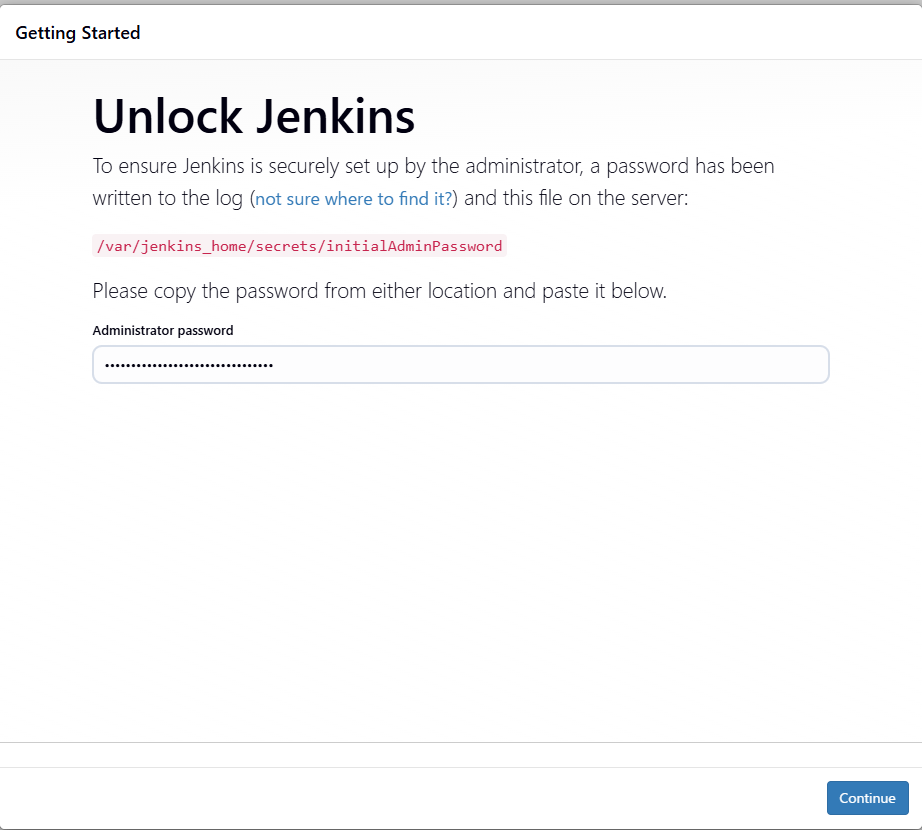
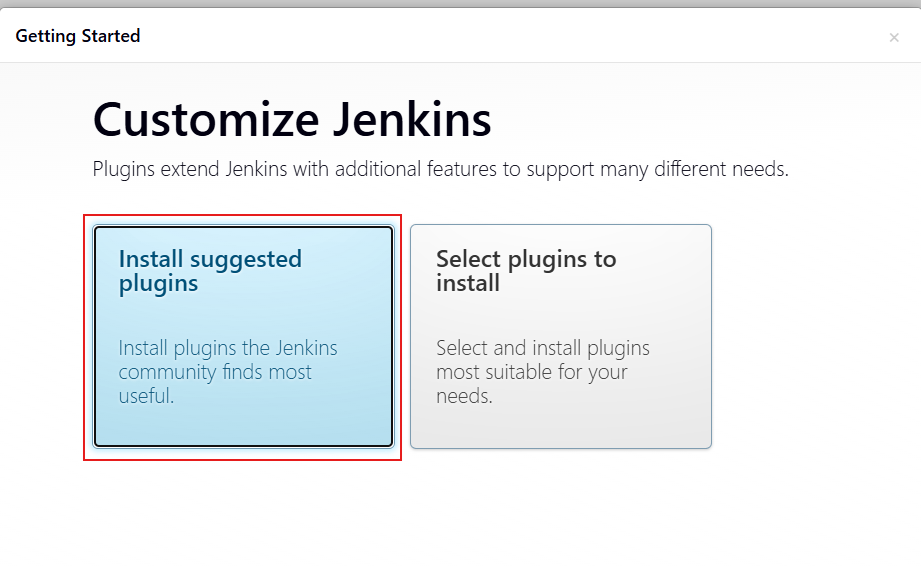
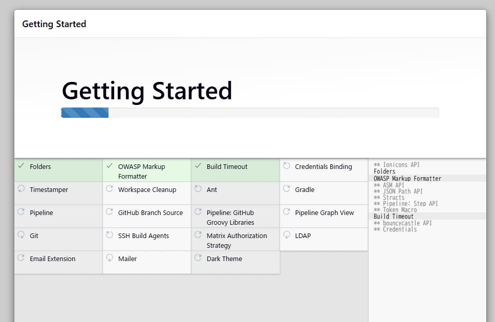
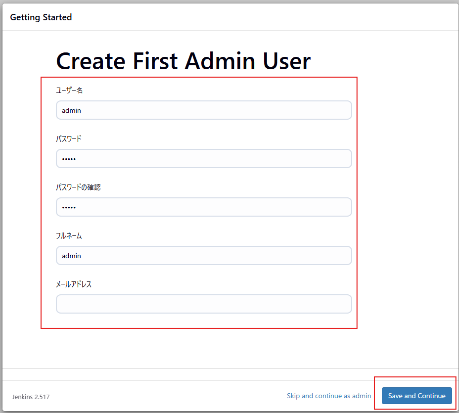
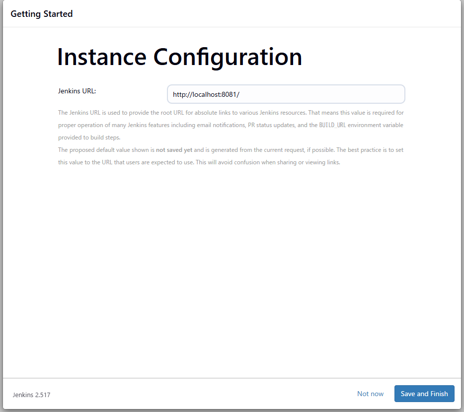
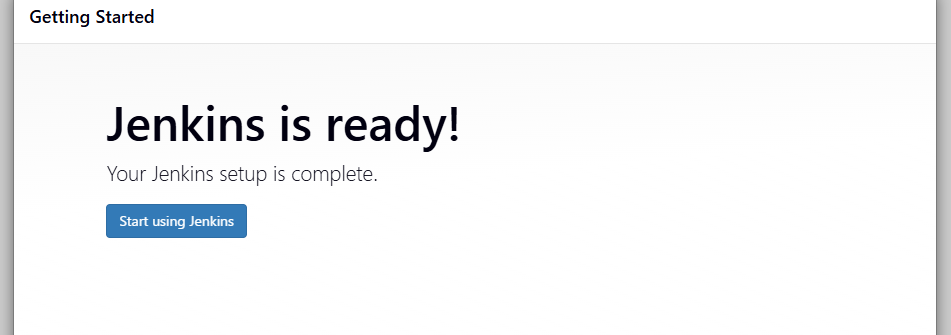

# Jenkins環境構築
Ver : jenkins/jenkins:2.517-jdk21
## インストール
```
git clone https://github.com/gonchi282/DockerPractice
cd Dockerfile
./install.sh 
```

## コンテナ起動
docker compose up -d jenkins

## コンテナ終了
docker compose down jenkins

## Jenkins初期設定
1. 下記コマンドで初期化用パスワード取得
```
docker exec  jenkins-server cat /var/jenkins_home/secrets/initialAdminPassword
出力例 : a3723410e60744328e79493500b04302
```
2. http://[Jenkinsサーバーのアドレス]:8081 にアクセス
1. 初期化用パスワードを入力して「Continue」

1. 「Install suggested plugins」を選択

1. 自動でプラグインのインストールが進

1. 管理用ユーザー設定を入力して「Save and Continue」

1. URL設定 デフォルトで「Save and Finish」

1. 「Start using Jenkins」


## DooDするときは下記参照
https://qiita.com/hiroyuki_onodera/items/c6c6e6163d61ddf4dd5c
